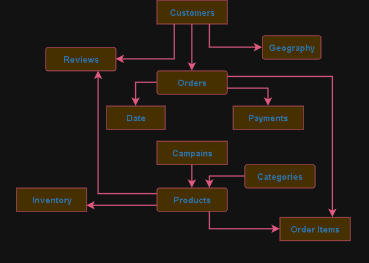

# Entity Relationship Diagram (ERD)

## Objective

The ERD represents the logical database design for the ShopSphere
E-Commerce Intelligence Platform.

It defines the entities, relationships,
primary keys, and foreign keys required
to support analytics, reporting,
machine learning, and AI modules.

---

## Entities

- Customers
- Orders
- Order Items
- Products
- Categories
- Reviews
- Inventory
- Payments
- Campaigns
- Geography
- Date

---

## Relationships

- One Customer can place many Orders.
- One Order contains many Order Items.
- One Category contains many Products.
- One Product can appear in many Order Items.
- One Product has one Inventory record.
- One Product can receive many Reviews.
- One Customer can write many Reviews.
- One Order has one Payment.
- One Customer belongs to one Geography.
- One Order belongs to one Date.

---

## ERD Diagram

---
